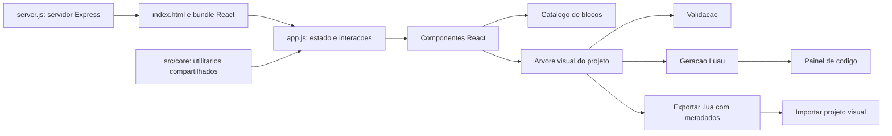

# Documentacao do site

Este documento descreve a aplicacao Roblox Lua Builder: o que aparece no editor, como os blocos viram Luau, onde cada responsabilidade vive no repositorio e quais limites considerar ao integrar um MCP.

- Site publicado: [Roblox Lua Builder](https://tnoronho-sg.github.io/Roblox-Code-Editor/)
- Mapa estruturado para automacao: [mcp-site-map.json](mcp-site-map.json)
- Especificacao MCP e arquitetura dos blocos: [mcp-arquitetura.md](mcp-arquitetura.md)
- Entrada da pagina: [index.html](../index.html)
- Controlador do editor: [app.js](../app.js)
- Estilos: [styles.css](../styles.css)

## Visao geral

O site e um editor visual de pagina unica. A interface usa React, com componentes de classe para blocos com entradas e para o painel de codigo, e componentes funcionais para blocos sem entradas. O Express serve o HTML, os estilos, o bundle de navegador e os audios do Typing Rush. A arvore, o catalogo e os geradores continuam modulares em `src/`. Nao ha roteador, API de dominio, banco de dados, autenticacao ou execucao remota de scripts.



## Executar e testar

Requisito: Node.js disponivel no ambiente.

```bash
npm start
```

O Express compila `app.js` para `dist/app.js` ao iniciar e serve a aplicacao em `http://localhost:3000`.

```bash
npm test
```

Os comandos e dependencias estao definidos em [package.json](../package.json). React e React DOM compoem a interface; Express serve a aplicacao e esbuild gera o bundle do navegador.

## Mapa da interface

| Area | Funcao | Operacoes principais |
| --- | --- | --- |
| Barra superior | Identidade e acoes do projeto | Renomear, desfazer/refazer, salvar/carregar, trocar tema/idioma, limpar, abrir o minigame e validar para uso no Roblox Studio |
| Biblioteca | Encontrar blocos | Pesquisar, filtrar por categoria e arrastar blocos para o canvas |
| Barra do editor | Ferramentas do canvas | Selecionar ou mover o canvas, duplicar, mostrar/ocultar codigo inline, zoom e grade |
| Canvas | Montar a logica | Inserir, conectar, encaixar em corpos, reordenar, selecionar, editar e excluir blocos |
| Barra de estado | Resumo do editor | Quantidade de blocos e zoom |
| Codigo gerado | Visualizar Luau | Copiar codigo, ver estado de validacao e numero de linhas |
| Inspector | Editar o bloco selecionado | Alterar propriedades e consultar resumo/previa |
| Painel de erros | Diagnosticos | Mostrar estado valido ou mensagens de validacao |
| Typing Rush | Minigame de digitacao | Iniciar/reiniciar desafio, digitar, controlar volume e fechar |

O Typing Rush e parte auxiliar do site, nao participa da geracao do projeto. Ele usa codigo gerado ou conteudo de texto como desafio e pode carregar arquivos de audio de `memes/`.

## Fluxo de edicao

1. O catalogo e filtrado por categoria e texto de busca.
2. Ao soltar um bloco no canvas, o editor cria um no com valores padrao.
3. Blocos de comando/estrutura podem formar sequencias ou corpos. Blocos de valor/expressao entram em sockets tipados.
4. O sistema de conexoes rejeita encaixes incompatíveis; o usuario pode editar valores nos blocos ou no Inspector.
5. As alteracoes atualizam a validacao e o codigo Luau exibido.
6. Desfazer/refazer usa historico em memoria, limitado a 30 snapshots.

Atalhos implementados: `Ctrl/Cmd+Z` desfaz, `Ctrl/Cmd+Y` refaz, `Ctrl/Cmd+D` duplica o bloco selecionado, `Delete` exclui e `Escape` fecha o Typing Rush.

## Catalogo de blocos

O catalogo usado pela interface esta definido em `definitions` dentro de [app.js](../app.js). `libraryOrder` preserva a ordem de exibicao, enquanto `categories` e `categoryAliases` definem as abas. Os nomes de exibicao tem traducoes em ingles e portugues.

Categorias visiveis:

| Categoria | Area |
| --- | --- |
| Events | Eventos e gatilhos |
| Control | Condicoes, repeticoes e fluxo |
| Operators | Logica, comparacao, texto e matematica |
| Variables | Variaveis e valores |
| Functions | Definicao e chamada de funcoes |
| Players | Jogadores |
| Character / Humanoid | Personagens e Humanoid |
| Instance / Objects | Instancias e objetos |
| Properties | Propriedades e atributos |
| Methods | Chamadas de metodos |
| Sound | Audio e SoundService |
| Workspace / World | Workspace, terreno e mundo |
| UserInput / Controls | Teclado e controles |
| Multiplayer / RemoteEvents | Comunicacao entre cliente e servidor |
| Administration | Acoes administrativas |
| Debug | Depuracao |
| Teams / Leaderstats | Times e placares |
| Backpack / Tools | Ferramentas e mochila |
| DataStore | Persistencia no Roblox |
| Roblox Services | Servicos Roblox |
| Advanced / Luau | Recursos avancados de Luau |

Algumas definicoes antigas usam aliases internos: `logic` e `math` aparecem em `operators`; `movement` e `teleport` em `objects`; `appearance` e `ui` em `properties`; `audio` em `sound`.

Cada definicao pode conter id, categoria, rótulo, icone, template Luau, valores padrao, metadados de entradas, opcoes de operador, tipo visual e indicacao de corpo filho. [VisualBlockDefinition.js](../src/core/VisualBlockDefinition.js) normaliza definicoes para os tipos visuais:

- `COMMAND`: instrucao que pode se conectar a uma sequencia.
- `STRUCTURE`: instrucao com um ou mais corpos de comandos.
- `VALUE`: valor tipado que pode ser encaixado em uma entrada.
- `EXPRESSION`: expressao tipada que pode ser encaixada em uma entrada.

Os tipos de entrada/saida incluem `NUMBER`, `TEXT`, `BOOLEAN`, `PLAYER`, `OBJECT`, `POSITION`, `COLOR`, `SOUND` e `ANY`. Entradas podem aceitar literais ou conexoes de valor/expressao.

## Modelo do projeto

A arvore e mantida em memoria. Cada no visual tem os campos:

| Campo | Descricao |
| --- | --- |
| `id` | Identificador unico do no |
| `type` | Id da definicao do bloco |
| `definitionId` | Id da definicao usada para construir o bloco |
| `properties` | Valores literais ou blocos conectados |
| `inputs` | Valores de entrada, espelhados para compatibilidade |
| `next` | Proximo bloco da sequencia |
| `bodies` | Corpos nomeados contendo listas de blocos |
| `children` | Alias legado de `bodies.body` |

[VisualBlockTree.js](../src/core/VisualBlockTree.js) cria, procura, conecta, insere, remove e conta nos. [VisualConnectionSystem.js](../src/core/VisualConnectionSystem.js) valida conexoes de sequencia, corpo e valor. [VisualTypeSystem.js](../src/core/VisualTypeSystem.js) fornece compatibilidade de tipos visuais.

## Validacao, geracao e arquivos

A validacao ativa em `app.js` verifica valores vazios, condicoes incompletas e alguns blocos estruturais sem corpo. O painel exibe ate tres mensagens por vez.

A geracao percorre a arvore e preenche templates Luau com valores e expressoes conectadas. O serializador de expressoes fica em [LuauExpressionSerializer.js](../src/core/LuauExpressionSerializer.js). O botao **Run script** nao executa o codigo: valida e informa que o teste deve ser feito no Roblox Studio.

Salvar baixa um arquivo `.lua` com o codigo gerado e um comentario contendo metadados base64 UTF-8. O marcador atual e `ROBLOX_LUA_BUILDER_PROJECT_V1:`; o payload guarda versao, titulo e arvore visual. [VisualProjectFile.js](../src/core/VisualProjectFile.js) implementa leitura, escrita e normalizacao desses metadados. Um arquivo Luau sem esse marcador nao restaura os blocos.

Apesar do texto **Autosave ativo** na interface, o projeto nao e persistido em `localStorage`, `sessionStorage`, IndexedDB ou servidor. Para preservar o trabalho, use a acao de salvar.

## Estrutura do repositorio

```text
.
|-- app.js
|-- index.html
|-- styles.css
|-- package.json
|-- package-lock.json
|-- README.md
|-- docs/
|   |-- estrutura-do-site.md
|   `-- mcp-site-map.json
|-- memes/                         Audio do Typing Rush
|-- src/
|   |-- blocks/                    Definicoes modulares de blocos
|   |-- core/                      Registro, tipos, arvore e serializacao
|   `-- generators/luau/           Geradores modulares de codigo
`-- tests/
    `-- framework.test.js
```

### Modulos centrais

| Arquivo | Responsabilidade |
| --- | --- |
| `BlockRegistry.js` | Registrar blocos e consultar por id/categoria |
| `CodeBuilder.js` | Construir codigo indentado |
| `ContextSystem.js` | Regras de contexto server/client/shared |
| `LuauExpressionSerializer.js` | Serializar valores e expressoes Luau |
| `ReferenceSystem.js` | Registrar e resolver referencias Roblox |
| `ScopeSystem.js` | Declarar e consultar escopo de variaveis |
| `TypeSystem.js` | Compatibilidade de tipos gerais |
| `VisualBlockDefinition.js` | Normalizar definicoes e tipos visuais |
| `VisualBlockTree.js` | Operacoes da arvore de blocos |
| `VisualConnectionSystem.js` | Regras de conexao visual |
| `VisualProjectFile.js` | Metadados e importacao/exportacao de projetos |
| `VisualTypeSystem.js` | Compatibilidade de tipos visuais |

### Blocos e geradores modulares

`src/blocks/` e `src/generators/luau/` tem pares de arquivos nas categorias abaixo:

| Pasta | Arquivos |
| --- | --- |
| `appearance/` | `setColor.js` |
| `audio/` | `playSound.js` |
| `character/` | `jumpCharacter.js`, `setWalkSpeed.js` |
| `control/` | `if.js`, `wait.js`, `while.js` |
| `events/` | `playerJoined.js` |
| `input/` | `inputPressed.js` |
| `logic/` | `and.js`, `boolean.js`, `comparison.js`, `not.js`, `or.js` |
| `math/` | `arithmetic.js` |
| `movement/` | `moveObjectBy.js`, `movePartBy.js` |
| `objects/` | `setProperty.js` |
| `teleport/` | `teleportTo.js` |
| `ui/` | `showText.js` |
| `variables/` | `setScore.js`, `setVariable.js` |

### Testes

[framework.test.js](../tests/framework.test.js) usa o runner nativo `node:test`. Cobre contratos do framework, tipos e conexoes, geradores modulares, serializacao de expressoes, formato do projeto e alguns comportamentos do catalogo ativo em `app.js`.

## Limite entre editor e framework

O editor importa `VisualBlockDefinition`, `VisualBlockTree`, `VisualConnectionSystem`, `VisualProjectFile` e `LuauExpressionSerializer`. O catalogo e a geracao de comandos continuam dentro de `app.js`.

O framework tambem tem `BlockRegistry`, `CodeBuilder`, `ContextSystem`, `ReferenceSystem`, `ScopeSystem`, `TypeSystem` e `VisualTypeSystem`, mas esses modulos nao sao importados pelo caminho ativo do editor. As definicoes em `src/blocks/` e os geradores em `src/generators/luau/` sao uma camada modular testada, ainda nao unificada com o catalogo amplo da interface. Evite assumir que alterar um gerador modular muda automaticamente a saida do site.

## Preparacao para MCP

O manifesto [mcp-site-map.json](mcp-site-map.json) e a versao legivel por maquina deste mapa. A integracao recomendada e um servidor MCP separado, sem importar `app.js`, porque esse arquivo acessa o DOM durante a inicializacao.

Operacoes iniciais adequadas:

- Consultar e descrever categorias/blocos.
- Validar uma arvore de projeto recebida como entrada.
- Gerar Luau a partir de uma arvore.
- Decodificar e codificar arquivos de projeto `.lua`.

Para isso, sera necessario extrair o catalogo e a logica pura de validacao/geracao para modulos compartilhados sem dependencias do navegador. As operacoes podem ser sem estado: o processo MCP recebe a arvore, executa a transformacao e devolve o resultado. O site nao oferece acesso remoto ao estado aberto no navegador.

Nao ha suporte atual para executar Luau, publicar projetos no Roblox, salvar projetos em nuvem ou executar codigo arbitrario enviado pelo usuario.