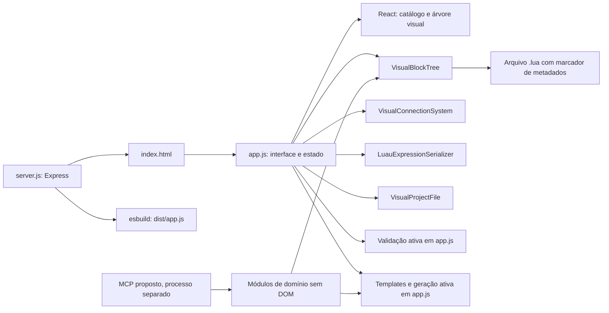

# Arquitetura do MCP e dos blocos

Este documento especifica como um servidor MCP pode expor a estrutura do Roblox Lua Builder, seu catálogo de blocos e transformações de projetos. Ele complementa o [mapa do site em JSON](mcp-site-map.json) e a [documentação funcional do editor](estrutura-do-site.md).

> **Estado atual:** este repositório ainda não contém servidor MCP, transporte MCP, configuração de cliente ou ferramentas MCP executáveis. Os recursos e ferramentas abaixo são uma especificação de integração, não endpoints já disponíveis. O guia descreve o código existente e marca explicitamente os limites entre o editor ativo e o framework modular.

## 1. Objetivo e limites

O MCP proposto deve tornar consultáveis a arquitetura, as definições dos blocos e o formato dos projetos, além de oferecer transformações determinísticas de árvore visual para Luau. Deve funcionar como processo separado e sem estado de sessão: recebe uma entrada, valida/transforma e retorna o resultado, sem depender do navegador aberto.

Não deve importar `app.js`: esse arquivo inicializa a interface e acessa elementos do DOM. Também não deve tentar ler ou alterar o projeto que está aberto no navegador, executar Luau, publicar no Roblox, autenticar usuários nem persistir projetos remotamente. Nenhuma dessas capacidades existe no servidor Express atual.

## 2. Arquitetura existente



`server.js` compila o ponto de entrada `app.js` para navegador e serve `index.html`, `styles.css`, `dist/app.js` e os arquivos de áudio de `memes/`. É uma aplicação de página única, sem roteador de cliente, API de domínio, banco de dados ou autenticação.

O fluxo do editor ativo é:

1. O catálogo privado de `app.js` fornece rótulos, categorias, valores padrão e templates.
2. `normalizeVisualCatalog` transforma as definições antigas em definições visuais usadas na renderização.
3. `VisualBlockTree` mantém a árvore em memória; `VisualConnectionSystem` verifica conexões; React representa blocos, sockets, corpos e sequências.
4. Alterações passam pela validação e pela geração ativa em `app.js`; `LuauExpressionSerializer` trata expressões e valores ligados a sockets.
5. A exportação grava Luau e um marcador com a árvore visual. A importação recupera o marcador e normaliza os nós.

Os detalhes da interface, controles e limitações funcionais estão em [estrutura-do-site.md](estrutura-do-site.md); o inventário de áreas da página e os caminhos do repositório estão em [mcp-site-map.json](mcp-site-map.json).

## 3. Dois contratos de blocos

Há duas camadas de blocos. Um servidor MCP precisa saber qual delas está consultando para não retornar uma descrição ou geração que não corresponda ao editor.

### 3.1 Catálogo ativo da interface

A fonte de verdade do editor visual atual é o objeto `definitions` dentro de `app.js`, complementado por `categories`, `categoryAliases`, traduções e `libraryOrder`. Esse catálogo está privado no controlador do navegador; não é exportado por módulo e não é consumido pelo servidor Express.

As definições seguem o formato legado, com campos como:

| Campo | Uso |
| --- | --- |
| chave do catálogo | Identificador estável usado como `node.type` |
| `type` | Categoria visual/legada do bloco |
| `label`, `icon` | Apresentação na interface |
| `template` | Modelo usado pela geração ativa de Luau |
| `props` | Valores iniciais das propriedades |
| `propsMeta` | Metadados das entradas: rótulo, tipo de editor e modo de conexão |
| `operatorOptions` | Opções de um seletor de operador, quando aplicável |
| `kind`, `output`, `children` | Tipo visual, saída tipada e presença de corpo filho |

A estrutura exata varia entre definições. `VisualBlockDefinition.js` converte `propsMeta` em `inputs` normalizados. Uma entrada marcada como `socket` aceita blocos `VALUE` ou `EXPRESSION`; as demais são entradas literais. Tipos de saída ausentes são tratados como `ANY` em caminhos visuais.

As categorias e aliases da interface não são necessariamente os mesmos nomes usados pelas pastas modulares. Exemplos de aliases legados: `logic` e `math` para `operators`; `movement` e `teleport` para `objects`; `appearance` e `ui` para `properties`; `audio` para `sound`.

### 3.2 Blocos modulares do framework

`src/blocks/` contém definições reutilizáveis e `src/generators/luau/` contém geradores correspondentes. Os módulos de bloco declaram em geral `id`, `category`, `name`, `type`, `contexts`, `description`, `tooltip`, `inputs` e, quando necessário, uma função `validation`. As entradas modulares usam objetos como `{ name, type, required, default }`. O gerador exporta uma função JavaScript que recebe um objeto e devolve texto Luau.

Inventário modular presente no repositório:

| Categoria | Blocos |
| --- | --- |
| `appearance` | `setColor` |
| `audio` | `playSound` |
| `character` | `jumpCharacter`, `setWalkSpeed` |
| `control` | `if`, `wait`, `while` |
| `events` | `playerJoined` |
| `input` | `inputPressed` |
| `logic` | `and`, `boolean`, `comparison`, `not`, `or` |
| `math` | `arithmetic` |
| `movement` | `moveObjectBy`, `movePartBy` |
| `objects` | `setProperty` |
| `teleport` | `teleportTo` |
| `ui` | `showText` |
| `variables` | `setScore`, `setVariable` |

Esses módulos são cobertos por testes e podem ser registrados com `BlockRegistry`, mas o catálogo e a geração ativos do editor **não estão unificados com eles**. O contrato modular (`inputs`, callback de validação e função geradora) não é equivalente ao contrato ativo (`propsMeta`, propriedades e template). Alterar um arquivo em `src/blocks/` ou `src/generators/luau/` não altera automaticamente o site.

Exemplo: `jumpCharacterBlock` descreve uma entrada `character` e contextos server/client; `generateJumpCharacter` recebe `{ character }` e produz uma sequência com verificação de `Humanoid`. Já o bloco `if` usa o gerador modular `generateIf`, que compõe uma condição e um corpo em texto. Esses geradores recebem valores JavaScript, não nós visuais serializados. Um adaptador MCP deve converter explicitamente a árvore para o contrato apropriado; não deve passar um nó diretamente e presumir que os formatos coincidem.

## 4. Tipos visuais, conexões e árvore

`VisualBlockDefinition.js` define quatro tipos visuais:

| Tipo | Significado | Conexões esperadas |
| --- | --- | --- |
| `COMMAND` | Instrução de sequência | anterior/próximo comando |
| `STRUCTURE` | Instrução com um ou mais corpos | sequência e corpos de comandos |
| `VALUE` | Valor encaixável | saída tipada para socket |
| `EXPRESSION` | Expressão encaixável | saída tipada para socket |

Os tipos visuais são `NUMBER`, `TEXT`, `BOOLEAN`, `PLAYER`, `OBJECT`, `POSITION`, `COLOR`, `SOUND` e `ANY`. A hierarquia visual atual permite `PLAYER` onde se espera `OBJECT` e `SOUND` onde se espera `OBJECT`; `ANY` é compatível com qualquer tipo. `VisualConnectionSystem` só aceita comandos/estruturas em sequência, comandos/estruturas em corpos e valores/expressões em entradas compatíveis.

A árvore usada pelo editor e pelo arquivo de projeto tem nós com esta forma conceitual:

```json
{
  "id": "id-unico",
  "type": "id_do_catalogo",
  "definitionId": "id_do_catalogo",
  "properties": {},
  "inputs": {},
  "next": null,
  "bodies": { "body": [] },
  "children": []
}
```

- `next` encadeia a sequência seguinte.
- `bodies` mapeia nomes de corpo para listas de comandos; é relevante para blocos estruturais.
- `children` é um alias legado do corpo `body`; a normalização atual restaura esse alias.
- `properties` contém valores literais ou nós de blocos conectados.
- `inputs` espelha os valores de `properties` para compatibilidade. Em arquivos carregados, a normalização toma `properties` como base e reconstrói `inputs`.

`VisualBlockTree` cria, localiza, conecta, insere, destaca, atualiza e conta nós. A busca visita sequências, corpos, filhos e valores ligados. Operações remotas devem trabalhar em uma cópia da árvore recebida e devolver um resultado, sem mutar estado global. A árvore é recursiva; limite profundidade, quantidade de nós e tamanho do JSON no limite MCP.

Não confundir `VisualTypeSystem` com `TypeSystem`: o primeiro usa rótulos visuais em maiúsculas e regras de encaixe do editor; o segundo usa tipos de domínio como `number`, `string`, `Instance`, `Player` e `Humanoid`, com regras próprias. `ContextSystem` valida compatibilidade server/client/shared, `ScopeSystem` trata visibilidade de variáveis, `ReferenceSystem` resolve referências Roblox e `CodeBuilder` ajuda a montar código indentado. Esses módulos centrais não são importados pelo caminho ativo do editor.

## 5. Geração, validação e formato de arquivo

Existem dois caminhos de geração:

1. **Editor ativo:** `app.js` consulta templates do catálogo ativo, resolve propriedades e blocos ligados e serializa expressões com `LuauExpressionSerializer.js`.
2. **Framework modular:** cada função em `src/generators/luau/` gera Luau a partir de seus argumentos JavaScript. `CodeBuilder` oferece helpers para indentação e estruturas de controle, mas os geradores podem retornar strings diretamente.

A validação visual ativa também vive em `app.js`; os callbacks `validation` dos módulos são outro caminho e não substituem essa validação. Para obter paridade com o site, um MCP deve compartilhar/extrair a implementação ativa, ou declarar claramente que usa o conjunto modular. Não deve misturar definições de um catálogo com templates ou validações do outro.

O formato de projeto usado no site é um arquivo `.lua` cujo comentário final contém `ROBLOX_LUA_BUILDER_PROJECT_V1:` seguido de Base64 UTF-8 de JSON `{ version: 1, title, tree }`. `VisualProjectFile.js` lê, escreve e normaliza os metadados. Luau sem o marcador pode ser usado como código, mas não restaura a árvore visual. A leitura de metadados não executa nem interpreta o Luau.

## 6. Interface MCP proposta

### Recursos

| URI | Fonte | Conteúdo |
| --- | --- | --- |
| `roblox-builder://site-map` | `docs/mcp-site-map.json` | Página, áreas, fluxo de dados e árvore do repositório |
| `roblox-builder://architecture` | `docs/mcp-arquitetura.md` | Contratos dos blocos, arquitetura, limites e integração MCP |
| `roblox-builder://block-catalog` | Manifesto extraído do catálogo ativo | IDs, categorias, tipos, entradas, defaults, conexões e documentação dos blocos |
| `roblox-builder://project-schema/v1` | `VisualBlockTree.js` e `VisualProjectFile.js` | Schema da árvore e envelope de projeto versionado |

Os recursos devem indicar versão da fonte e camada do catálogo (`active-ui` ou `modular-framework`). Não gere um catálogo manual paralelo como fonte de verdade: derive um manifesto das definições compartilhadas ou mantenha geração verificável no build.

### Ferramentas

| Ferramenta | Entrada principal | Saída esperada | Efeito |
| --- | --- | --- | --- |
| `list_block_catalog` | filtro opcional `category`, `kind`, `query`, `source` | blocos resumidos e contagem | leitura |
| `describe_block` | `block_type` e, opcionalmente, `source` | definição completa, entradas, saída, conexões, contexto e gerador associado | leitura |
| `validate_project` | `tree`, contexto opcional | `valid` e diagnósticos estruturados com código, mensagem e caminho do nó/entrada | computação pura |
| `generate_luau` | `tree`, contexto opcional | Luau, status e diagnósticos | computação pura; nunca executa Luau |
| `decode_project_file` | texto `.lua` | código, título, versão e árvore, ou erro de metadados | computação pura |
| `encode_project_file` | `tree`, título opcional | texto `.lua` com marcador de projeto | computação pura |

Para chamadas de catálogo, `source` deve ser explícito ou devolver ambas as fontes separadas. Se só o catálogo ativo for pedido, responda com essa origem e informe que ainda está privado em `app.js`; se só os blocos modulares forem pedidos, não os apresente como se estivessem disponíveis na biblioteca visual atual.

Formato de diagnóstico recomendado:

```json
{
  "valid": false,
  "diagnostics": [
    {
      "code": "UNKNOWN_BLOCK_TYPE",
      "message": "O tipo de bloco não existe no catálogo selecionado.",
      "node_id": "node-1",
      "path": "tree[0].type"
    }
  ]
}
```

Valide a árvore e os tipos antes da geração. Erros devem ser dados estruturados, não exceções não tratadas nem texto Luau parcial apresentado como válido. Em geração com erros, escolha e documente uma política estável; a recomendação é não retornar código como sucesso.

## 7. Segurança e comportamento operacional

- Trate árvores, strings de entrada e arquivos `.lua` como dados não confiáveis.
- Não use `eval`, `Function`, shell, executor Luau ou API de publicação.
- A geração é composição de texto baseada em definições conhecidas, não uma sandbox nem prova de segurança do script resultante.
- Aplique limites configuráveis de bytes, profundidade e número de nós para evitar payloads excessivos ou recursão abusiva.
- Não revele caminhos locais, variáveis de ambiente ou estado do navegador nas respostas MCP.
- Mantenha `validate_project`, `generate_luau`, `encode_project_file` e `decode_project_file` determinísticos para a mesma versão do catálogo.

## 8. Plano de integração

1. Extrair `definitions`, metadados de categorias, traduções e regras ativas de `app.js` para módulos puros sem acesso ao DOM; fazer o editor importar esses módulos.
2. Extrair/adaptar a geração e a validação ativas para funções puras e cobri-las com testes. Não substituir a geração ativa pelos geradores modulares sem um adaptador e testes de paridade.
3. Publicar um manifesto versionado derivado do catálogo compartilhado, incluindo distinção entre catálogo ativo e framework modular.
4. Implementar o processo MCP separado e registrar os recursos e ferramentas desta especificação, limitando o acesso à API pública MCP.
5. Testar amostras de sequência, corpo, socket tipado, bloco desconhecido, projeto sem metadados, metadados inválidos e payloads além dos limites.

## 9. Verificação atual

- Testes do repositório: `npm test` (`node --test`).
- Build do site: `npm run build`.
- Não há hoje testes MCP, servidor MCP, pacote de protocolo, transporte ou configuração de cliente. Esses itens só podem ser verificados depois da implementação da integração.
